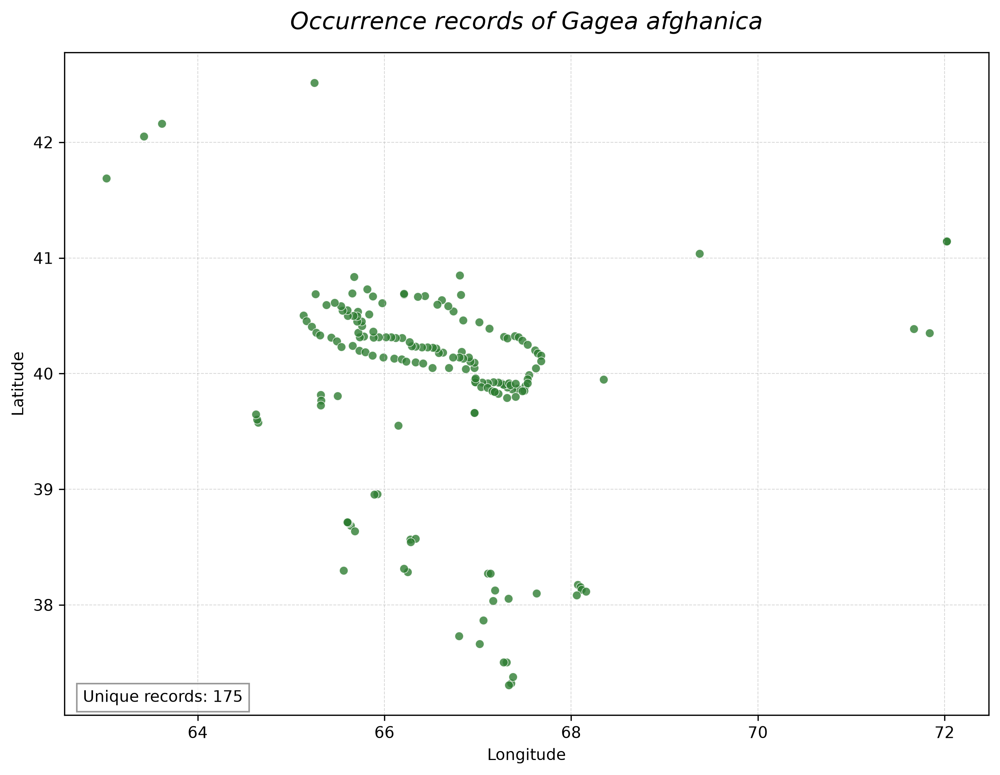

# Gagea Biodiversity Analysis

A reproducible computational biodiversity project focused on the genus *Gagea* in Uzbekistan and Central Asia.

## About the Project

This repository demonstrates the integration of botanical research with Python, GIS, biodiversity informatics, and spatial analysis.

The project is designed as a reproducible workflow for processing occurrence data, analysing species diversity and distribution patterns, and producing publication-quality outputs.

## Research Workflow

Raw biodiversity data  
↓  
Data cleaning and standardization with Python  
↓  
Geographic coordinate validation  
↓  
Spatial analysis in GIS  
↓  
Species richness and distribution analysis  
↓  
Endemism and biogeographic analyses  
↓  
Species distribution modelling  
↓  
Publication-quality maps and figures

## Methods and Tools

- Python
- pandas and NumPy
- GeoPandas
- Matplotlib
- GIS and spatial analysis
- Biodiversity informatics
- Species richness analysis
- Endemism analysis
- Species distribution modelling
- Phylogenetic and biogeographic data integration

## Repository Structure

```text
gagea-biodiversity-analysis/
│
├── data/
│   ├── raw/
│   └── processed/
│
├── scripts/
│
├── notebooks/
│
├── figures/
│
├── maps/
│
└── README.md ## Example Output

└── README.md
```

## Example Output

### *Gagea afghanica* occurrence records

The raw dataset contained 194 occurrence records. After coordinate validation and removal of exact duplicates, 175 unique occurrence records were retained for analysis.


